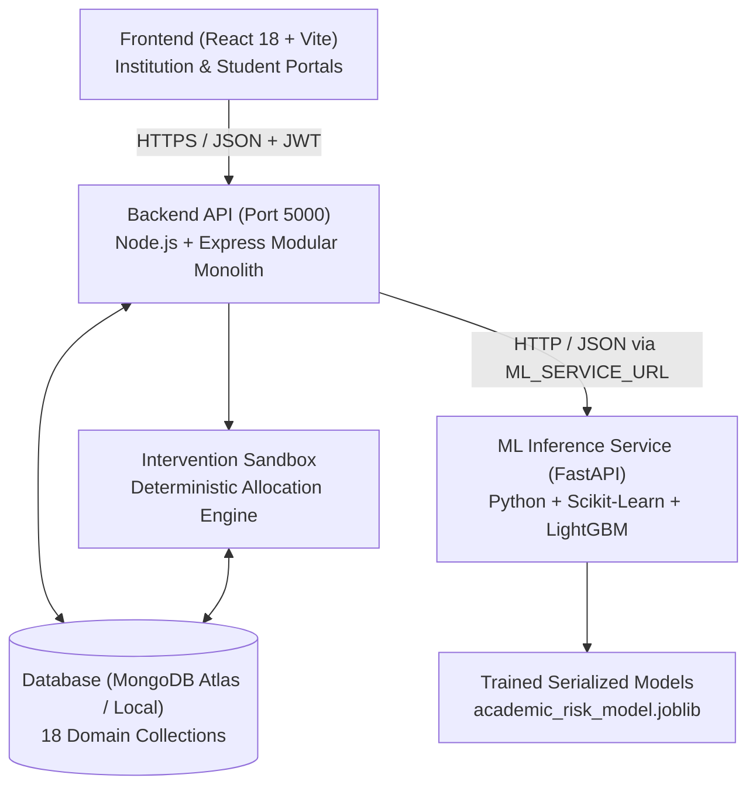

# Smart Campus Analytics: Predict, Optimize & Improve Student Success (PRATIBHA)

**Hackathon:** HacXLerate 2026 — Round 1  
**Partner:** KPMG in India (Challenge 4)  
**Team:** Team AARYA  
**Database:** MongoDB Atlas  
**Core Architecture:** Modular Decision-Support Platform with Decoupled ML Engines  

---

## 1. Project Overview

**PRATIBHA: Smart Campus Analytics** is an AI-powered student success and decision-intelligence platform built for higher education institutions. Rather than acting as a passive dashboard displaying charts, the platform converts multi-source campus data into actionable intelligence for faculty mentors, placement officers (TPOs), administrators, and students.

### The Problem It Solves
Colleges generate large amounts of data through attendance registers, internal assessments, university examinations, LMS activity, placement participation, extracurricular activities, and student feedback. However, this data is often stored in disconnected silos (ERP, biometric machines, Excel sheets, Moodle). PRATIBHA unifies these silos into an explainable, proactive intelligence platform.

### The Two Connected Portals
1. **Institution Portal:**
   - **Executive Overview:** Institutional KPI trends, average success scores, cohort distribution.
   - **Student 360° Directory:** 1,420 student profiles with decoupled academic & placement risk flags.
   - **Decoupled Risk Radar:** Independent ML models for Academic Risk (LightGBM) vs Placement Readiness (Logistic Regression).
   - **Student Archetypes (5 Cohorts):** Behavioral segmentation for proactive outreach.
   - **Intervention Sandbox (Decision Simulator):** Resource-constrained simulation engine (seats, budget, duration).
   - **Batch Data Studio (8 Pillars):** Departmental bulk CSV uploader with streaming bounded row validation.
   - **Campus Feedback:** Anonymous student sentiment analysis with differential privacy.
   - **Audit Trail:** Immutable security logs of user access and intervention allocations.
   - **Campus Copilot:** Natural language & Hinglish grounded AI assistant (zero LLM hallucination).

2. **Student Self-Portal:**
   - Individual performance dashboard and explainable Student Success Score (`sss-v1`).
   - Academic trajectory, classroom attendance breakdown, LMS engagement minutes, and skill radar.
   - Placement readiness assessment and recommended career action plans.
   - Active faculty intervention tracking and personalized progress milestones.

---

## 2. Multi-Pillar Campus Data Ingestion Architecture

The platform unifies all student performance categories through our **Batch Data Ingestion Studio**:

| # | Category | Institutional Data Source | Key Indicators & Attributes |
| :- | :--- | :--- | :--- |
| 1 | **Student Onboarding** | Registrar & Admissions ERP | Student ID, full name, department, degree program, current semester, cohort |
| 2 | **Academic** | Controller of Examinations (CoE) | CGPA, SGPA, semester marks, internal assessments, history of backlogs, credits |
| 3 | **Attendance Telemetry** | Biometric RFID & Attendance Portal | Overall attendance percentage, sessions held vs attended, subject-level telemetry |
| 4 | **LMS Digital Learning** | Moodle / Canvas / Google Classroom | Login count, active days, assignments assigned vs completed, engagement minutes |
| 5 | **Placement Assessments** | Training & Placement Cell (TPO) | Aptitude scores, quantitative logic, coding assessments, mock interview evaluations |
| 6 | **Skill & Lab Tests** | Department Computing Labs | Programming languages, DSA benchmarks, technical certifications, soft skills |
| 7 | **Co-Curricular Engagement** | Student Affairs & Cultural Council | Hackathon participation, club leadership, sports, workshop hours, results |
| 8 | **Campus Feedback** | IQAC Quality Assurance Cell | Anonymous student satisfaction ratings, faculty course evaluations (staff-only visibility) |

---

## 3. System Architecture & Tech Stack



- **Frontend Application:** React 18, Vite, React Router v6, Lucide React, Recharts. Vanilla CSS tokens inspired by Google Cloud / AWS console design.
- **Backend API:** Node.js + Express modular monolith with rate-limiting, Helmet security headers, Winston logging, and comprehensive error handling.
- **Database:** MongoDB with Mongoose ODM (18 models: Student, AcademicRecord, AttendanceRecord, LmsActivity, RiskPrediction, StudentScore, AuditEvent, etc.).
- **ML Inference Engine:** Dedicated Python service running LightGBM and Scikit-Learn models trained on 50,000 verified student records.

---

## 4. Key Differentiator: Intervention Sandbox & Decision Simulator

Most campus analytics tools stop at predicting risk. The **Student Success Decision Simulator (Intervention Sandbox)** helps colleges decide what actions to take under real-world resource constraints.

### How It Works:
- **Resource Constraints:** Institutions have limited mentoring seats and operational budgets (e.g., 30 seats for 100 at-risk students).
- **Strategy Comparison:** Administrators compare candidate strategies (Skill-Gap Prioritized, Uniform Cohort, or Mixed Allocation).
- **Transparent Logic:** Allocation decisions are deterministic and explainable without fabricating causal percentage gains.
- **Outcome Tracking:** Monitors student attendance and improvement after intervention approval.

---

## 5. Machine Learning & Analytics Architecture

### Conceptual Separation (Decoupled Engines)
- **Student Success Score (`sss-v1`):** A deterministic, explainable composite metric (0 to 100) based on weighted contributions (35% Academic, 20% Placement, 15% Attendance, 12% LMS, 10% Skills, 8% Engagement).
- **Academic Risk Model:** Supervised LightGBM classifier predicting students at risk of semester failure or probation.
- **Placement Risk Model:** Supervised classifier predicting placement readiness gaps. High CGPA students can still exhibit high placement risk if interview skills lag (Decoupled Divergence).

### Empirical Validation
- **Dataset:** 50,000 verified student records (`kaggle.csv`) with 17 engineered features.
- **Academic Risk Leaderboard:**
  - **LightGBM:** **0.8570 F1** | **0.9497 ROC-AUC** (Selected)
  - **Random Forest:** 0.8566 F1 | 0.9504 ROC-AUC
  - **XGBoost:** 0.8566 F1 | 0.9502 ROC-AUC
  - **Logistic Regression:** 0.6975 F1 | 0.9458 ROC-AUC
- **Placement Risk Leaderboard:**
  - **Logistic Regression:** **0.6572 ROC-AUC** | 0.2156 F1 (Selected Baseline)
  - **LightGBM:** 0.6498 ROC-AUC | 0.1978 F1
  - **Random Forest:** 0.6448 ROC-AUC | 0.0828 F1

---

## 6. Repository Structure

```
├── Frontend/                         # React 18 + Vite Frontend Application
│   ├── src/
│   │   ├── components/               # UI components, layout, Copilot drawer
│   │   ├── pages/                    # 8 Institution pages + Student portal
│   │   ├── services/                 # api.js client with live API & synthetic fallbacks
│   │   └── styles/                   # tokens.css & global design system
├── backend/                          # Node.js + Express API Service (Port 5000)
│   ├── src/
│   │   ├── api/v1/                   # REST API routes
│   │   ├── models/                   # 18 Mongoose domain schemas
│   │   ├── ingestion/                # CSV parsing & dry-run streaming validation
│   │   ├── scores/                   # Deterministic sss-v1 Success Score engine
│   │   ├── copilot/                  # Natural language & Hinglish grounded Copilot
│   │   └── server.js                 # Server entry point
│   ├── scripts/seed.js               # Database seeder (120 synthetic students)
│   └── tests/                        # 17 comprehensive backend test suites
├── models/                           # Serialized ML artifacts & model metadata
│   ├── academic_risk_model.joblib    # Trained LightGBM academic risk classifier
│   ├── placement_risk_model.joblib   # Trained placement classifier
│   ├── feature_scaler.joblib         # StandardScaler fitted on 17 features
│   └── model_metadata.json           # Model registry schema & benchmark scores
├── ml_service.py                     # Python FastAPI microservice for ML inference
├── kaggle.csv                        # 50,000-record benchmark dataset
└── README.md                         # Project overview & documentation
```

---

## 7. Quick Start & Local Execution

### 1. Start the Backend API (Port 5000)
```bash
cd backend
npm install
node scripts/seed.js    # Seeds 120 detailed students & category records into MongoDB
npm start               # Starts Express server at http://localhost:5000
```

### 2. Start the Frontend (Port 5173)
```bash
cd Frontend
npm install
npm run dev             # Starts Vite development server at http://127.0.0.1:5173
```

### 3. (Optional) Start the Python ML Inference Service
```bash
python -m venv venv
source venv/bin/activate  # On Windows: venv\Scripts\activate
pip install fastapi uvicorn scikit-learn lightgbm joblib pandas numpy
python ml_service.py      # Starts ML inference service on port 8000
```

---

## 8. Responsible AI & Governance Principles

- **Data Privacy:** Strict role-based access control (RBAC). Students cannot view records belonging to peers.
- **Fairness & Non-Discrimination:** Sensitive demographic attributes (gender, caste, religion, income) are strictly excluded from all predictive models.
- **Explainability First:** Every risk flag and success score exposes explicit human-readable driver factors.
- **Human-in-the-Loop:** All predictive outputs are advisory decision-support signals. Final intervention approvals require faculty or administrator sign-off.
