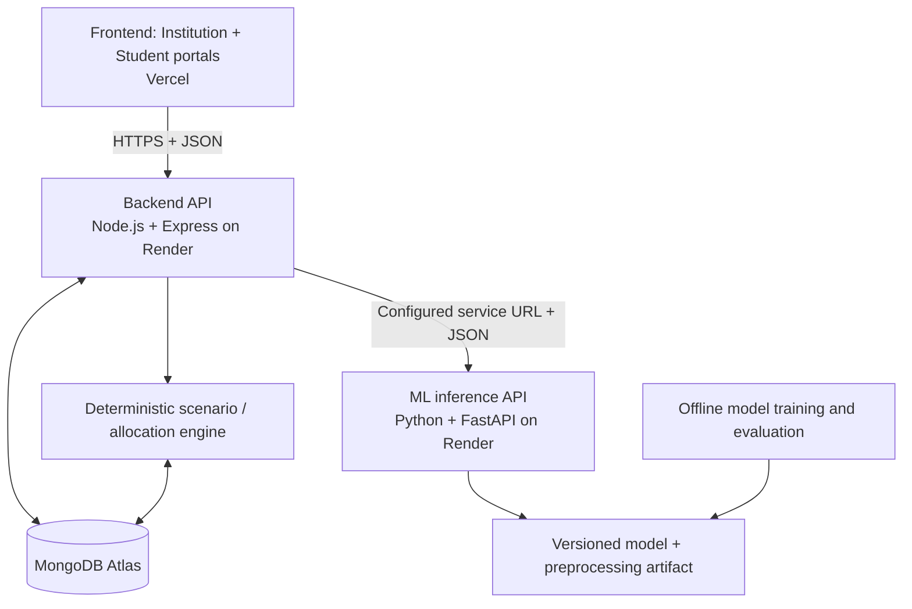

# Smart Campus Analytics — Backend Architecture

**Document:** `ARCHITECTURE.md`  
**Version:** 1.0  
**Scope owner:** Backend + MongoDB  
**Status:** Initial implementation baseline; revise decisions explicitly rather than silently.

## 1. Product context

Smart Campus Analytics is being built for the KPMG in India challenge, **“Smart Campus Analytics: Predict, Optimize & Improve Student Success.”** The platform combines student data, calculates an explainable Student Success Score, identifies academic and placement risks, and helps institutions plan and evaluate supportive interventions.

The application has two user experiences (Institution Portal and Student Portal), but both must use the same backend services and data definitions. The backend is the source of truth for authorization, persisted records, score calculations, orchestration of ML requests, and intervention-scenario rules.

## 2. Architecture goals

1. Cover the required problem-statement capabilities with working APIs, not UI placeholders.
2. Allow frontend and ML work to proceed independently through stable JSON contracts.
3. Use MongoDB Atlas for persistent application data.
4. Deploy the backend and Python model-inference service independently on Render; deploy the frontend on Vercel.
5. Keep the first version understandable and testable: use a **modular monolith** for the Node backend, not unnecessary microservices.
6. Keep the ML training pipeline separate from online inference.
7. Treat scores and model output as decision support. Do not fabricate model performance or claim causal intervention impact without evidence.

## 3. System context



### Runtime responsibilities

- **Frontend / Vercel:** presentation, forms, filters, charts and user interactions. It must not connect directly to MongoDB or call the ML service directly.
- **Backend / Render:** REST API, authentication, role-based access, data validation, MongoDB reads/writes, Student Success Score, calls to ML inference, analytics aggregation and scenario/intervention logic.
- **MongoDB Atlas:** persistent student records, source records, user roles, score snapshots, predictions, scenarios, interventions and audit events.
- **ML inference service / Render:** loads the trained model and its exact preprocessing pipeline; validates model features; returns a versioned prediction response. It does not own user authentication or independently query MongoDB in the initial architecture.
- **Offline training:** owned by the ML teammate. Training/evaluation artifacts are versioned and then made available to the inference service. The backend is not responsible for training a model.

## 4. Backend logical modules

A single deployable Express app should be organized by domain. Exact folders can follow the existing repository, but responsibilities should remain separated.

| Module | Responsibility |
|---|---|
| `config` | Environment validation, CORS origins, URLs, database configuration |
| `middleware` | Authentication, role authorization, request IDs, error handling, request validation |
| `auth` | Login, password hashing/verification, token issuing, current-user identity |
| `students` | Student identity, profile, search, cohort queries |
| `ingestion` | CSV/JSON import, category validation, dry run, import report |
| `student-data` | Academic, attendance, LMS, engagement, placement, skills and feedback records |
| `features` | Consistent model/score feature preparation from data available at a specified date |
| `success-score` | Deterministic score formula, versioned component details and missingness rules |
| `predictions` | ML-service client, request validation, timeout/error mapping and persisted prediction snapshots |
| `analytics` | Institution summary, trends, cohort aggregates and paginated summaries |
| `segments` | Clear, versioned segment definitions and student membership |
| `interventions` | Intervention catalog, assignment, progress and observed outcomes |
| `simulations` | What-if scenario validation, eligibility, capacity-constrained allocation and plan comparison |
| `feedback` | Feedback submission and authorized aggregated access |
| `audit` | Security-relevant administrative/access events without unnecessary sensitive payloads |
| `health` | Liveness/readiness checks |
| `copilot` | Future/optional; thin orchestration layer over authorized APIs, never unrestricted database access |

A module may have a route/controller, service and repository/data-access layer where useful. Avoid both one giant controller and premature microservices.

## 5. Data flow

### Student-data integration
1. Authorized staff uploads a CSV/JSON dataset through the backend.
2. The backend validates category, file/record size, required columns, types and ranges.
3. Preview/dry-run reports row-level errors before records are committed.
4. A successful import normalizes records and links them using the stable `student_id`.
5. The API returns an import summary: received, accepted, rejected, warnings and an import identifier.

### Success score
1. Retrieve the student's eligible data for the specified period.
2. Create normalized components under one documented, versioned formula.
3. Apply the defined missing-data rule. Missing values must not silently become zero.
4. Persist the score, component values, period, formula version, calculation timestamp and explanation.

### ML prediction
1. Backend constructs features using data available at the prediction timestamp.
2. Backend sends the agreed feature JSON to the ML service URL stored in environment configuration.
3. ML service validates features and returns model version, target, risk/readiness output and supported explanation fields.
4. Backend validates and stores the response, maps service errors to stable API errors, and returns a role-appropriate representation.
5. No ML request should bypass user authorization. Missing ML service is reported as unavailable; do not silently fabricate a result.

### Intervention simulation
1. Staff defines a cohort/selection, intervention types and resource limits.
2. The deterministic scenario engine checks eligibility and allocates resources using explicitly named rules.
3. The system returns selected/excluded students with reasons, capacity use, assumptions and any evidence-supported estimates.
4. An authorized staff member reviews and approves the plan before assignments are created.
5. Participation and later outcomes are stored separately from scenario estimates.

## 6. MongoDB data architecture

Use separate collections for unbounded or time-based histories. Proposed collections:

- `users`
- `students`
- `academic_records`
- `attendance_records`
- `lms_activity`
- `engagement_records`
- `placement_assessments`
- `skill_assessments`
- `feedback_records`
- `imports`
- `student_features`
- `student_scores`
- `risk_predictions`
- `student_segments`
- `intervention_catalog`
- `interventions`
- `simulation_scenarios`
- `audit_events`

The exact fields and indexes are in `DESIGN.md`. Use a stable application-level `student_id` (for example, `STU_0001`) rather than exposing MongoDB `_id` as the only identifier. Keep record timestamps and term/period attributes so changes can be audited and features can be reconstructed at a prediction date.

## 7. Deployment topology

- Frontend: Vercel.
- Backend: Render web service, Node.js + Express.
- ML inference: separate Render web service, Python + FastAPI.
- Database: MongoDB Atlas.

Expected backend configuration (names are contractual; values are secrets/environment-specific):

```env
NODE_ENV=production
PORT=10000
MONGODB_URI=<secret>
JWT_SECRET=<secret>
JWT_EXPIRES_IN=...
FRONTEND_ORIGIN=https://<deployed-frontend-domain>
ML_SERVICE_URL=https://<ml-service-domain>
ML_SERVICE_TOKEN=<optional-shared-secret-if-supported>
LOG_LEVEL=info
```

Do not commit a real `.env`. Commit only `.env.example` with placeholders. Validate required environment variables at startup and fail clearly if a required production secret is absent. Configure CORS for known frontend origins, not `*` with credentials. Use HTTPS in deployed environments. Protect MongoDB Atlas with an appropriate network access policy and a least-privilege database user.

Render may place services on different hosts. Use the configured service URL and a timeout for ML requests; use a private service URL only if the deployed service plan and configuration support it. Never hardcode `localhost` in production code.

## 8. Cross-team integration contracts

The frontend, backend and ML teammates must use the same names and types. `DESIGN.md` defines the initial REST and payload contracts. Before changing a contract:
1. identify all affected consumers;
2. update the relevant documentation and tests;
3. communicate the change;
4. prefer additive, backward-compatible changes.

All API payloads use JSON except explicitly documented CSV uploads. All normal API routes are under `/api/v1`. IDs and dates must have one consistent representation.

## 9. Reliability and security

- Validate request bodies, query strings, IDs, upload sizes and allowed enum values.
- Enforce authentication and object-level authorization on every protected route.
- A student may access only their own private records; institution-level reads require the correct role and scope.
- Never trust a user-supplied role or `student_id` without verifying permissions.
- Use parameterized/ODM queries, avoid unbounded list endpoints and set pagination limits.
- Add request timeouts to the ML client and return a stable `503` when the model service is unavailable.
- Do not use ML output as the sole basis for consequential decisions.
- Do not log passwords, tokens, secrets, raw sensitive feedback, or unnecessary full student records.
- Return safe production errors; detailed stack traces are development-only.

## 10. Scope boundaries

### In scope for backend
Auth/RBAC, student profiles, seven data categories, imports and data quality, Student Success Score, academic/placement risk service integration, analytics endpoints, segmentation, intervention and scenario APIs, MongoDB persistence, API documentation, seed fixtures and tests.

### Explicitly not owned by backend
Frontend layout/components, ML training experiments and model selection, actual institutional source-system access, final deployment account setup, and choosing an LLM provider. Backend must define integration points for these without pretending they already exist.

## 11. Architecture decisions still open

- Final dataset source and its field/label availability.
- Final Student Success Score weights and missing-data policy.
- Academic and placement prediction targets and ML output contract details.
- Exact authentication deployment policy and user-provisioning workflow.
- Whether copilot is required in the first backend milestone or deferred until core PS APIs work.

Record approved changes in `MEMORY.md` and update affected schemas/contracts before implementation diverges.
